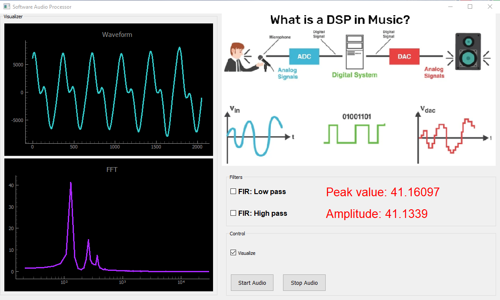

# Audio_Processor

Two ways of implementing digital audio processor:

# SW Audio processor

Relies on built-in soundcard and the PyAudio package. It allows to read the bytstream from the computer's soundcard, process it and write it back.
The stream continuity is not guaranteed and can be heavily dependant on the computer's workload. A good compromise between sound quality and the
waveform visualization capabilities has been achieved.

Folder contents:

- "Audio_Processor.py" - main Python script to run the program at the PC side

- "mainQWdg.ui" - widget template for the main window

- "DSP_Diagram.png" - to be replaced with the diagram that shows the working principle

# HW Audio processor

TBD:

Relies on the external "soundcard" implemented on the basis of Nexys Artix A7 FPGA board from Xilinx.
FPGA helps to keep sound stream continuity during the real-time processing of 24-bit 2-channel audio signal sampled at 44 kHz.
The samples are also sequentially stacked in an internal "sound buffer" which can be sent upon request to a PC via UART protocol and being visualized there.
On the PC side there is a PyQt-based application that polls the data from the UART and visualizes current "sound buffer's" contents.